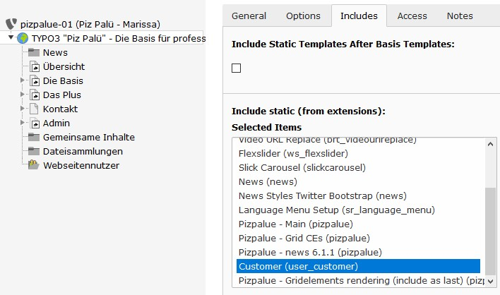
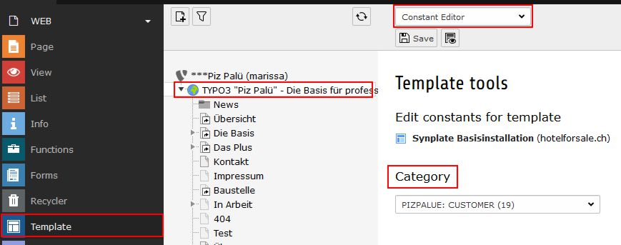
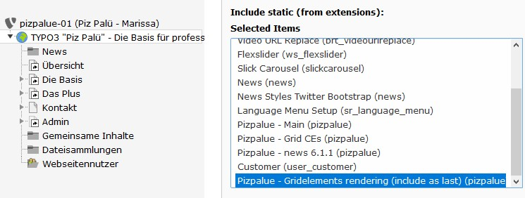

.. include:: ../Includes.txt

.. _administration:

Administration
==============

.. _admin_customize:

Customize
---------

The suggested way to customize the distribution for customer projects is to create an extension (e.g. user_customer)
and define the customer theme and functions in it (`see TYPO3 documentation
<https://docs.typo3.org/typo3cms/ExtbaseFluidBook/4-FirstExtension/Index.html>`__).

An example extension for that purpose is delivered and activated with the distribution. You might use it as your
starting point.

   Customize the distribution for customer projects

.. _admin_development:

Development
-----------

During development or maintenance phase two actions might be of interest:

#. Show under construction page
#. Enable code debugging

To temporarily show an under construction page the page "Baustelle" might be
moved before the root page where the code debugging can be enabled by activating
the debug mode in the "PIZPALUE: AGENCY" category from the constant editor.

.. _admin_configuration:

Configuration
-------------

Many aspects from the web site can be configured through the constant editor.

To ease configuration parameters were grouped. The following main categories
are available:

============================ ==================================================
Category                     Description
============================ ==================================================
PIZPALUE: GENERAL            A parameter in this category might be used for various module configurations
PIZPALUE: AGENCY             Everything related to the authority maintaining the site
PIZPALUE: CUSTOMER           Main customer related parameters
PIZPALUE: CUSTOMER STYLE     More detailed customer style related parameters
PIZPALUE: CUSTOMER SOCIAL    Definition from references to social networks
PIZPALUE: CUSTOMER VARIOUS   More detailed customer related parameters
============================ ==================================================

   Constant editor

.. tip::
   For further configurations the related extension configurations might be adjusted.

.. _admin_gridelements_rendering:

Gridelements rendering
----------------------

To structure the content area grid elements (provided by the extension gridelements) might be used. In conjunction with
the bootstrap_package the rendering lacks the container wrapping allowing the user to define a frame, a space before
or after and other container characteristics provided by the standard content element (tab appearance).

To provide the standard content element behaviour as well to grid elements a TS configuration is provided and available
through the template form (tab includes).

   Add grid elements rendering configuration

The grid elements rendering configuration should be included as last item. This allows that preceding grid elements
configurations from other extensions (e.g. user_customer) might be respected too.

.. note::
   In case you are updating from a version smaller than 8.3.6 the content from your web site might suddenly show bigger
   margins on top and bottom from each grid content element. To get the original appearance the frame setting for
   related content element might be changed to use 'no frame'.

   .. figure:: ../Images/Administration/Admin_GridelementsRendering_NoFrame.jpg
      :alt: Frame property from content element

      Frame property from content element