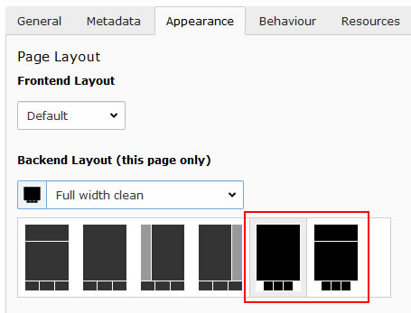
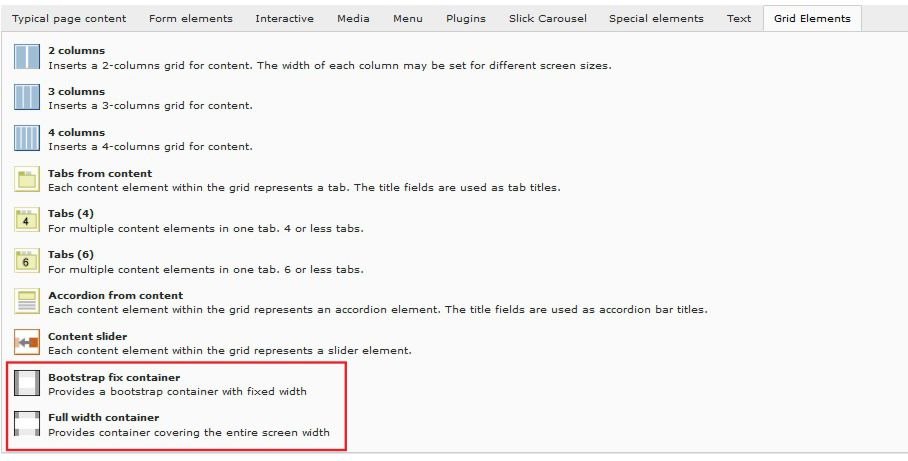
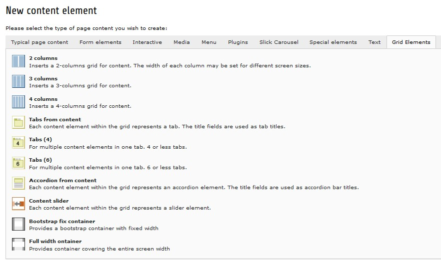
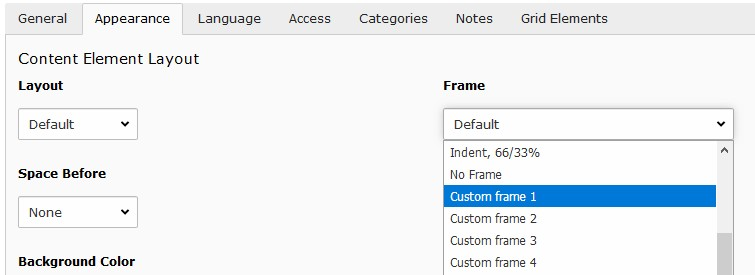
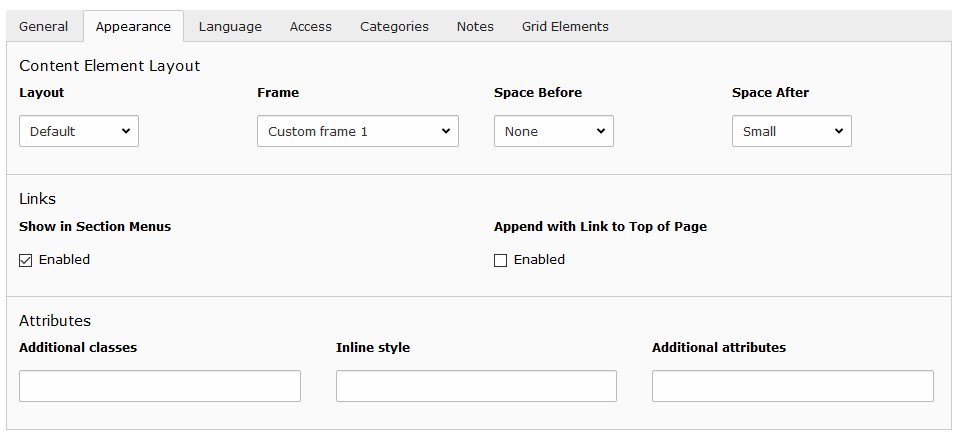

.. include:: ../Includes.txt

.. _user-design:

======
Design
======

.. _user-flexContentWidth:

Flexible content width
======================

To create content spanning the entire page width (`see example <https://www.pizpalue.buechler.pro/das-plus/flexible-inhaltsbreite/>`__)
one might use the "Full width" page layout in conjunction with the "Bootstrap
fix container" and "Full with container" grid elements:

   "Full width" page layout

   Container grid element

.. tip::
   To further customize the containers css-classes, attributes and a wrapping
   container might be defined in the "Plugin Options" section from the
   "General"-tab:

   .. figure:: ../Images/User/ContentWidth_ContainerOptions.jpg
      :width: 500px
      :alt: Container grid element plugin options

      Container grid element plugin options

.. _user-bootstrap_grids:

Grid elements
=============

Grid elements are used to further structure the content. Typically columns, accordions and registers are used for this
purpose. The available grid elements can be found in the new content element wizard or the content properties form
under the "Grid Elements" tab:

   "Grid Elements"-tab in new content element wizard

.. _user-customframes:

Custom frames
=============

Additional frames can be selected for content elements (`see example <https://www.pizpalue.buechler.pro/das-plus/gestaltung/rahmen/>`__):

   Custom frames for content elements

As for the time beeing the custom animations (Custom animation 1..3) aren't
implemented yet.

.. _ce-attributes:

Attribute enhancement for content elements
==========================================

Sometimes it would be handy to directly alter attributes from a content element container: add an additional class,
some inline style or additional attributes.

This functionality has been added by introducing additional fields to the content element table and adapting the
rendering accordingly. The new fields are available under the appearance tab in the "Attributes" palette.

   Palette "Attributes" under the appearance tab in the content element form

